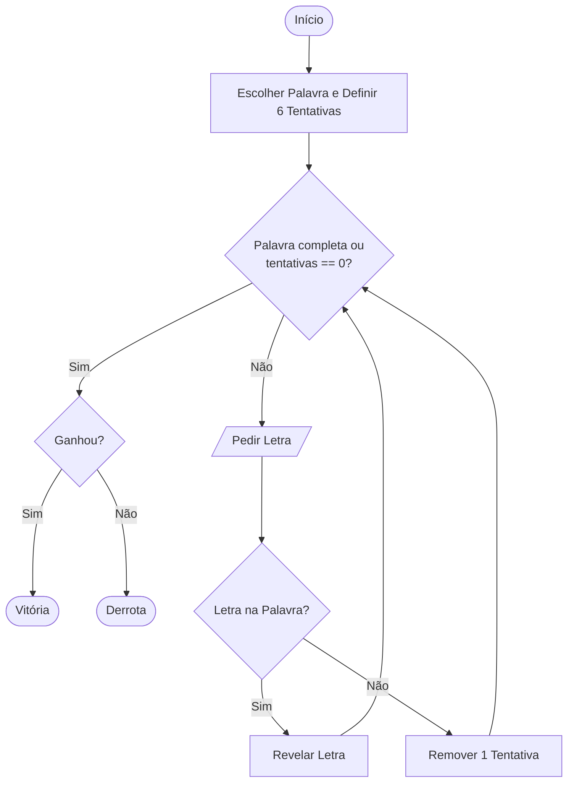

# Projeto: Jogo da Forca.

## Formulação do Problema
Este projeto é uma implementação em Python do jogo da forca para demonstrar lógica de programação e manipulação de strings.

### Definição do Jogo
*   **Objetivo:** Adivinhar a palavra secreta letra a letra antes de esgotar as 6 tentativas.
*   **Regras Principais:** O jogador insere uma letra; se errar, o boneco é desenhado; se acertar, a letra é revelada na posição correta.
*   **Entrada (Input):** Caracteres (letras) inseridos via teclado.
*   **Saída (Output):** Visualização da forca em arte ASCII e estado atual da palavra oculta.
*   **Condição de Vitória:** Revelar todas as letras da palavra.
*   **Condição de Derrota:** Esgotar as 6 tentativas (boneco completo na forca).

## Requisitos do Sistema

### Requisitos Funcionais
1. O sistema deve escolher uma palavra aleatória de uma lista pré-definida.
2. O sistema deve permitir que o utilizador introduza uma letra por vez.
3. O sistema deve verificar se a letra introduzida existe na palavra secreta.
4. O sistema deve exibir o progresso da palavra (letras acertadas e espaços vazios).
5. O sistema deve contabilizar os erros e desenhar a forca em arte ASCII.
6. O sistema deve informar o resultado final (Vitória ou Derrota).

### Requisitos Não Funcionais
1. **Usabilidade:** A interface deve ser simples e clara via consola de texto.
2. **Robustez:** O sistema deve validar entradas inválidas sem encerrar o programa.
3. **Compatibilidade:** O código deve ser executável em ambiente Python 3.
## Fluxograma do Jogo 

## Documentação do Utilizador

### Descrição do Jogo
O Jogo da Forca é um clássico desafio de palavras onde o utilizador tenta adivinhar uma palavra oculta antes que o boneco seja completamente desenhado na forca.

### Regras
1. Tens 6 tentativas para errar.
2. Letras repetidas não contam como erro.
3. Caracteres especiais ou números não são aceites (o sistema possui tratamento de erros).
4. Ganhas se revelares a palavra completa; perdes se o boneco for finalizado.

### Instruções de Execução
Para correr o jogo no teu computador:
1. Garante que tens o **Python 3** instalado.
2. Faz o download dos ficheiros `main.py` e `jogo.py` para a mesma pasta.
3. Abre o terminal/consola nessa pasta.
4. Executa o comando: `python3 main.py`

### Exemplo de Utilização
```text
--- JOGO DA FORCA (ROBUSTO) ---
Palavra: _ _ _ _ _ _
Tentativas restantes: 6
Digite uma letra: A
Boa! A letra existe.
Palavra: _ A _ _ _ A
```


